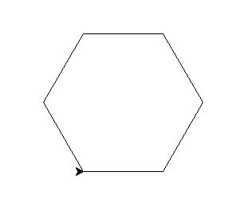

# Python Lab 2 (11/07/2024)

## 1. Solved the equation using python

### Equation:

$x^3 + y \times \frac{z}{2} - w$

$While:$
$w = 2$
$x = 3$
$y = 4$
$z = 5$

<hr>

## 2. Write a program to calculate the top area and Volume of a cylinder.

### Requirements:

#### Example input:

```
Enter Radius: 3
Enter Height: 2
```

#### Expected Output:

```
Area = 28.274333882308138
Volume = 56.548667764616276
```

<hr>

## 3. Please use turtle module and write Python statements to draw a shape below of size 100.

### Sample Image



<hr>

## 4. Write a Python program that prompts the user to enter the center and the radius of a circle, and then displays the circle and its area as shown. In this example, it shows a circle of radius 100.

### Sample Image


<hr>

Author: Pottarrพงศ์
Source: KMITL SE Python Lab